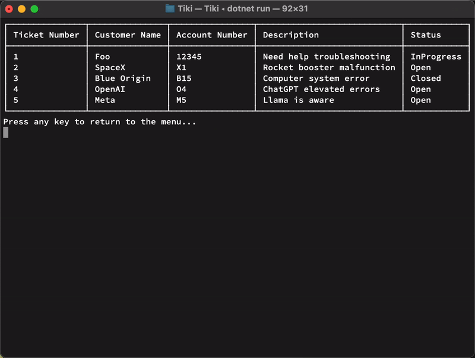

# Tiki



Tiki is a simple C# ticket support system built using a Text-Based User Interface (TUI) with [Spectre.Console](https://spectreconsole.net/). It supports basic ticket operations like creating, viewing, updating, and deleting tickets, with data persisted to a JSON file.

## Prerequisites

- [.NET SDK](https://dotnet.microsoft.com/download) (version 7.0 or later recommended)

## Project Structure

- **Tiki.App**: Contains the main application code.
- **Tiki.Tests**: Contains the unit tests for the application.

## Building the Application

Open a terminal in the root directory of the solution and run:

```sh
dotnet build
```
This command builds both the application and the test projects.

## Running the Application

You can run the application in two ways:

**Option 1:** From the ```Tiki.App``` Folder

- Navigate to the ```Tiki.App``` folder:
```sh
cd Tiki.App
dotnet run
```

**Option 2:** From the Solution Root

- Run the application by specifying the project file:
```sh
dotnet run --project Tiki.App/Tiki.App.csproj
```

## Running the Tests

To run the unit tests, execute the following command from the root of the solution:
```sh
dotnet test
```
This command will build and run all tests found in the Tiki.Tests project.

## Data Persistence

The application uses ```TicketDataService``` to save ticket data to a ```tickets.json``` file when the application exits and load the data on startup. Ensure you have write permissions in the directory where you're running the application.

## License

Copyright (c) Dan Barcinas <barcinasdan@gmail.com>

This project is licensed under the MIT license ([LICENSE] or <http://opensource.org/licenses/MIT>)

[LICENSE]: ./LICENSE
